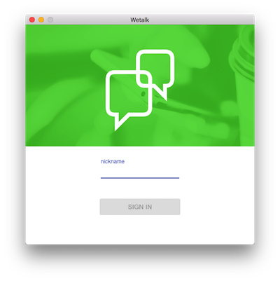
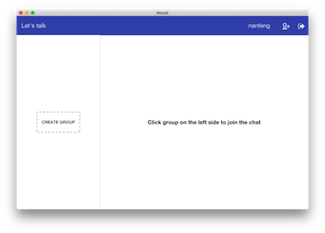
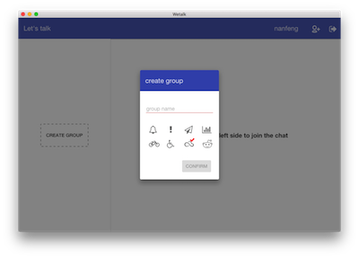

# wetalk-client #
A chat client

## What is it looks like? ##

## Want to contribute？ ##

Check it here: [Development Guide](./docs/start-guide.md)

## LICENSE ##

[MIT License](https://raw.githubusercontent.com/leftstick/wetalk-client/master/LICENSE)
