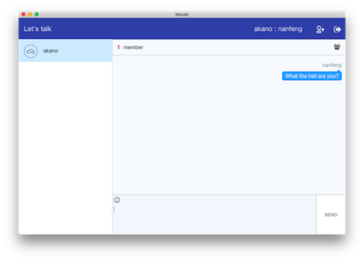

# wetalk-client #
A chat client

If you are looking for the server implementation, check it here: [wetalk-server](https://github.com/leftstick/wetalk-server)

## What is it looks like? ##

## Want to contribute？ ##

Check it here: [Development Guide](./docs/start-guide.md)

## LICENSE ##

[MIT License](https://raw.githubusercontent.com/leftstick/wetalk-client/master/LICENSE)
