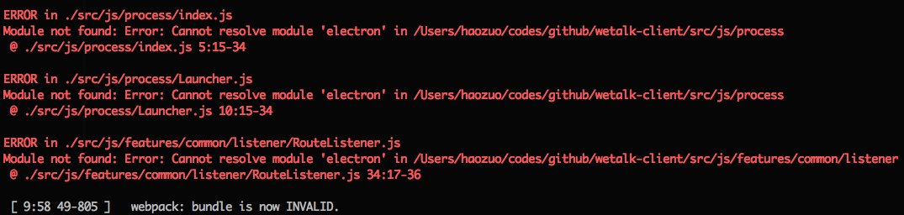

## Prerequisites ##

1. Install [node](https://nodejs.org/)
2. Install [gulp](https://github.com/gulpjs/gulp) globally, for example: `npm install -g gulp`
3. Install [python-2.7.11](https://www.python.org/downloads/release/python-2711/), and [setup-environment-variables](https://docs.python.org/2/using/windows.html#excursus-setting-environment-variables)
4. Install [visual-studio-community-2015](https://www.visualstudio.com/en-us/visual-studio-homepage-vs.aspx), and create a C++ project to make sure C++ compiler installed

## debug ##

### Clone Source Code ###

```bash
#move to a folder you preferred to work in
git clone https://github.com/leftstick/wetalk-client.git
```

### Install Dependencies ###

```bash
cd wetalk-client
npm install
```

>Above command will have dependencies(declared in `wetalk-client/package.json`) installed locally

### Launch compiler watcher ###

Type below command in ternimal:

```bash
gulp watch --api http://[server_address]:[server_port]/
```

This command will launch a special compiler server which continuously compile source code by using `webpack` whenever code is changed

##### options #####

- `api` The server address you would communicated with. default is `http://127.0.0.1:3000/`. **optional**

If you are encountering error as following:



Stop "watching" task, execute `gulp fix` task, and try `gulp watch` again

### Launch dev electron ###

Type below command in terminal:

```bash
gulp dev
```

This command launch the chatroom client.

> Use `ctrl + shift + i`(for windows), or`cmd + option + i`(for mac) to open `DevTools`

## Generate Application ##

Type below command in terminal:

```bash
gulp release --api http://[server_address]:[server_port]/
```

** Note **

If you are trying to release app on windows, make sure you have [7z](http://www.7-zip.org/) installed.

If you are trying to release app on osx, make sure you have [wine](https://www.winehq.org/) installed.

Two applications will be generated in `./dist/` for `windows-x64`, `osx-x64` platforms.
